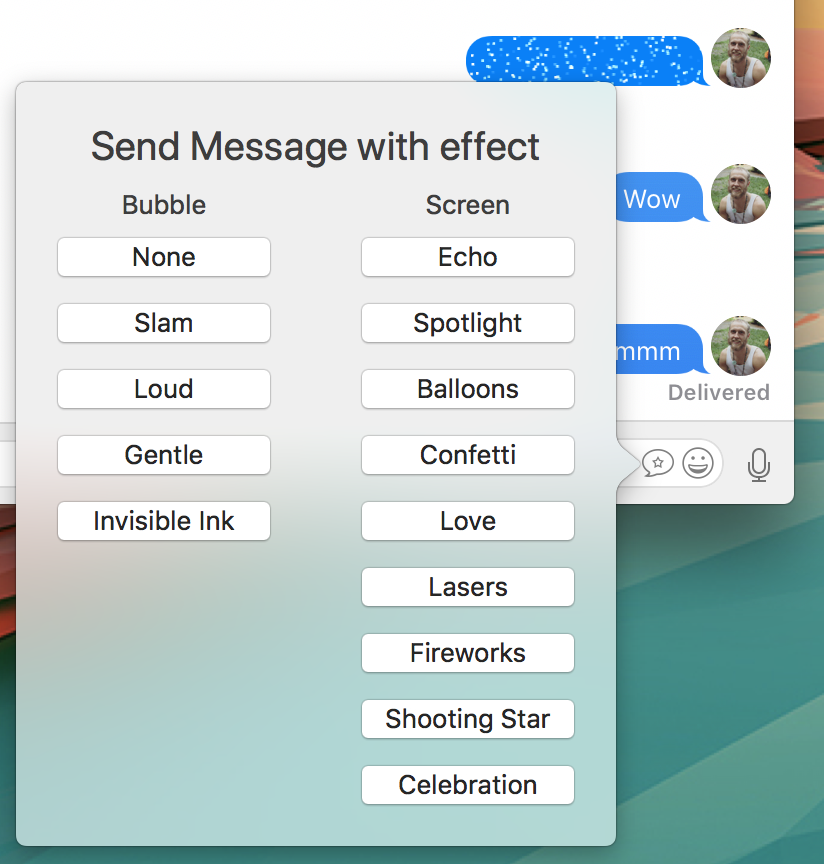

# iMessageParity

# Information:

- Designed for 10.10+
- iMessageParity is a MacForge plugin that allows you to send iMessages with effects on macOS
- Author: [w0lfschild](https://github.com/w0lfschild)

# Note:

- Based off code from [iMessageParity](https://github.com/LumingYin/iMessageParity) by [LumingYin](https://github.com/LumingYin/iMessageParity)

# Installation:

1. Download [MacForge](https://github.com/w0lfschild/app_updates/raw/master/MacForge/MacForge.zip)
2. install [iMessageParity](https://www.macenhance.com/mflink?macforge://github.com/w0lfschild/myRepo/raw/master/mytweaks/com.sky.imessageParity)
3. Restart `Messages.app`

### License:
Pretty much the BSD license, just don't repackage it and call it your own please!
Also if you do make some changes, feel free to make a pull request and help make things more awesome!
